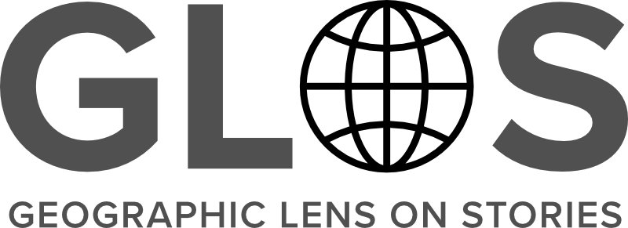

The Geographic Lens on Stories (GLOS) project aims to develop and publish a set of digital resources that extend current capabilities for the exploration and comparative analyses of written and transcribed stories across multiple genres and cultural traditions. In the project’s initial phase focusing on folklore, novel digital representations of two canonical indexes of folk literature, “The Types of International Folktales” and “Motif-Index of Folk-Literature” will be developed: a network graph of explicit relationships between tales, their component motifs, and language-based regions, and a database tuned to support semantic similarity measures and to supplement queries made to large language models (LLMs).