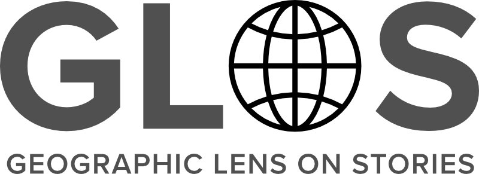

# Geographic Lens on Stories (GLOS) Project

*GLOS* is a multi-phase digital humanities project exploring the conceptual structures and geographic distribution of motifs, themes, and relationships in global vernacular literature, particularly folktales and creation myths.

## 📖 Project Documentation

- [Project Overview](docs/project-overview.md): Summary, goals, and structure
- [Phase A: Motif and Tale Type Index Tooling](docs/phase-a.md)
- [Phase B: Creation Myth Structuring and Analysis](docs/phase-b.md)

## 🅰️ Phase A: Folklore Index Embeddings and Tools

In this initial phase, the **Thompson Motif Index (TMI)** and **Aarne-Thompson-Uther Tale Type Index (ATU)** were digitized, normalized into a relational database, and embedded using natural language processing techniques. A suite of tools was developed to enable search, cross-referencing, and conceptual exploration of these foundational indices.

Recent work includes an interactive ATU/TMI interface within the GLOS Flask app that supports bidirectional lookup, browsing, and cross-referencing of tale types and motifs.

## 🅱️ Phase B: Creation Myth Structuring and Analysis

This phase focuses on extracting and modeling conceptual content from **creation myths**, initially using a sample of 20 myths from Barbara Sproul’s *Primal Myths*. Structured data was generated via large language models (LLMs) using JSON-LD, and multiple sets of embeddings were produced for comparative analysis. The goal is to develop an ontology that captures recurring mythic concepts across cultures.

Work in this phase is currently paused, pending further refinement of Phase A tooling.

---

© 2024-2025 GLOS Project.
